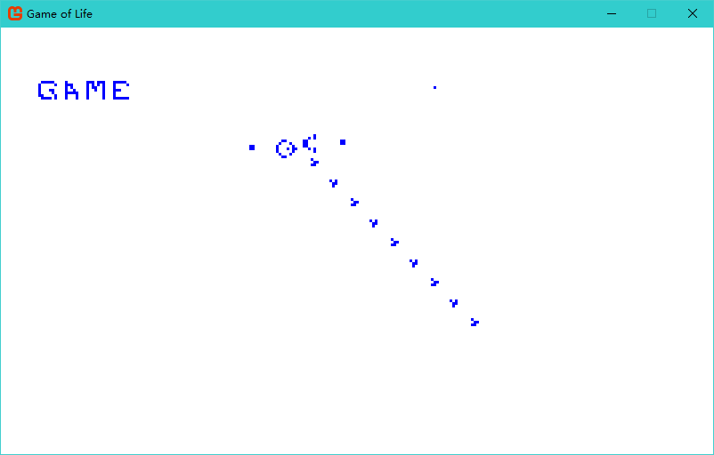

# Game of Life(生命游戏）

### 简介
>生命游戏是英国数学家约翰·何顿·康威在1970年发明的细胞自动机。它最初于1970年10月在《科学美国人》杂志中马丁·葛登能（Martin Gardner，1914年11月21日－2010年5月22日。又译：马丁·加德纳）的“数学游戏”专栏出现。
生命游戏其实是一个零玩家游戏，它包括一个二维矩形世界，这个世界中的每个方格居住着一个活着的或死了的细胞。一个细胞在下一个时刻生死取决于相邻八个方格中活着的或死了的细胞的数量。如果相邻方格活着的细胞数量过多，这个细胞会因为资源匮乏而在下一个时刻死去；相反，如果周围活细胞过少，这个细胞会因太孤单而死去。实际中，你可以设定周围活细胞的数目怎样时才适宜该细胞的生存。如果这个数目设定过低，世界中的大部分细胞会因为找不到太多的活的邻居而死去，直到整个世界都没有生命；如果这个数目设定过高，世界中又会被生命充满而没有什么变化。实际中，这个数目一般选取2或者3；这样整个生命世界才不至于太过荒凉或拥挤，而是一种动态的平衡。这样的话，游戏的规则就是：当一个方格周围有2或3个活细胞时，方格中的活细胞在下一个时刻继续存活；即使这个时刻方格中没有活细胞，在下一个时刻也会“诞生”活细胞。在这个游戏中，还可以设定一些更加复杂的规则，例如当前方格的状况不仅由父一代决定，而且还考虑祖父一代的情况。你还可以作为这个世界的上帝，随意设定某个方格细胞的死活，以观察对世界的影响。     
> 在游戏的进行中，杂乱无序的细胞会逐渐演化出各种精致、有形的结构；这些结构往往有很好的对称性，而且每一代都在变化形状。一些形状已经锁定，不会逐代变化。有时，一些已经成形的结构会因为一些无序细胞的“入侵”而被破坏。但是形状和秩序经常能从杂乱中产生出来。     
> [BaiKe](http://baike.baidu.com/link?url=HxV3hZGDTfZGJYJE-Y3qjIk3KE4vliafDxo59Xbnp3-MxPZEpuWa5S7yxS4-dB3kiamo4Hhn4ZypP-VCHbWeypFCGuZj4_fbpgQ-Qcs4RYJKYnZbRPNlFnLm5uf-E3Lr)

>The Game of Life, also known simply as Life, is a cellular automaton devised by the British mathematician John Horton Conway in 1970.     
>The "game" is a zero-player game, meaning that its evolution is determined by its initial state, requiring no further input. One interacts with the Game of Life by creating an initial configuration and observing how it evolves, or, for advanced "players", by creating patterns with particular properties.     
> [Wiki](https://en.wikipedia.org/wiki/Conway%27s_Game_of_Life)

### 操作说明

> **Space**： 运行/停止     
> **A** ： 下一代     
> **Left Click** ： 画细胞     
> **Right Click** ： 打死细胞     
> **W** ： 加快速度     
> **S**：减慢速度     

### 其他
[MonoGame](http://www.monogame.net/)

*date : 2017/ 07/ 01*
